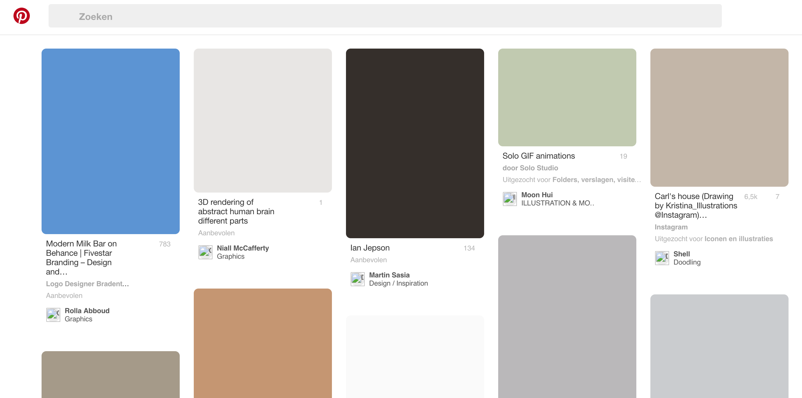
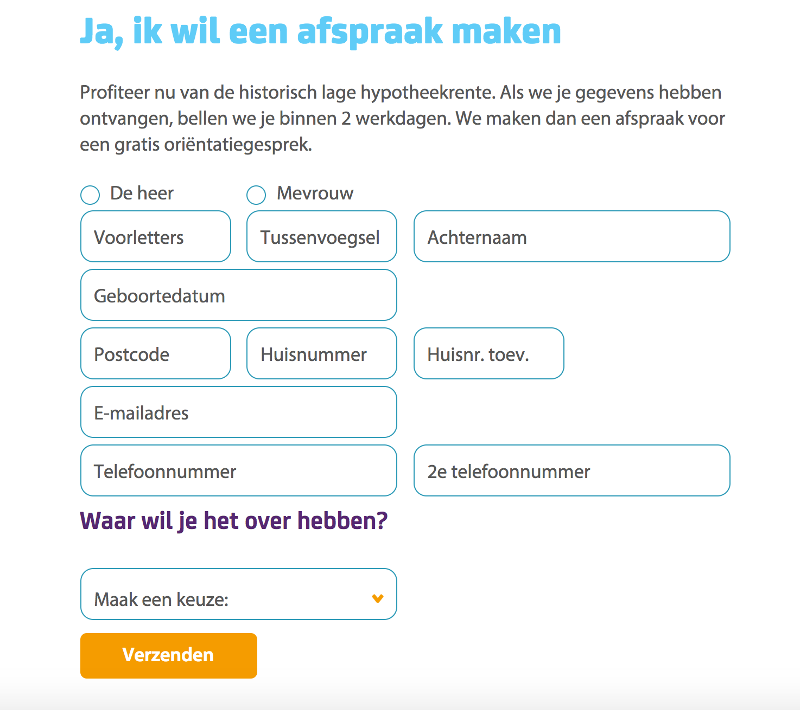
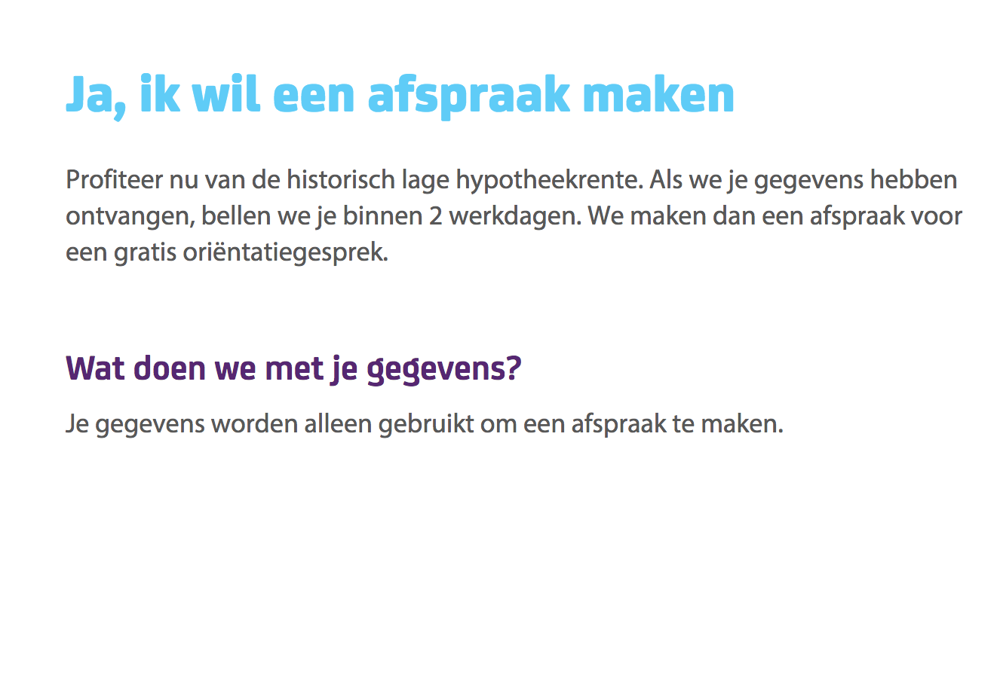
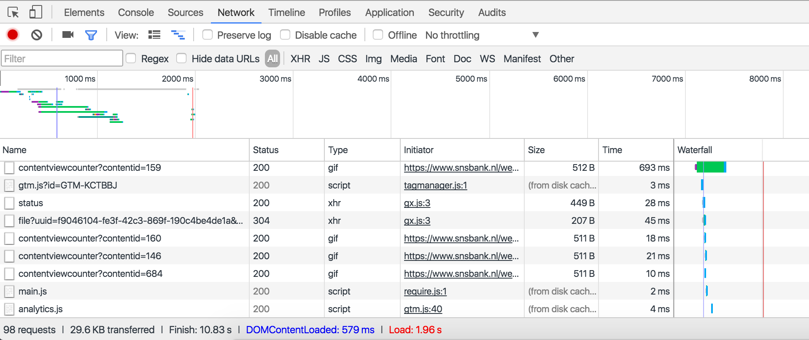

## Browser Technologies - Breaking the web 1.1

Features:
- [images](#images)
- [JavaScript](#javascript)

-----

## [images](#images)
To test what will happen if all the pictures aren't available, I used [Images ON/OFF](https://chrome.google.com/webstore/detail/images-onoff/nfmlhilnjccdggifdbhnhkffmjgalbgg).

I went to a few pages I visted right before the assignment:
- Pinterest
- SNSbank
- De doorverkoper
- Youtube

Pinterest uses background colors. If the image isn't available, you'll get an colored placeholder. I think this is a good solution, because you can see that images are missing, but it isn't filled with a lot of white space. Alt text can be a big help here.

Unlike the snsbank website. If they lose their images you almost get a white page.

De doorverkoper (built by me) is a WordPress website. If the header falls away you get an background color. If the logo falls away you can see a broken link. This could at least be fixed with a `min-height` and an alt text should be available.

A good example is Youtube, they use a `min-height` for their broken links. They could add an alt text to clarify the broken link.

### solutions
There are a few things you can do when your images breakdown:
- Use a background color to fill the placeholder
- You can add alt text (at least they have an indication of the pictue)
- You can use placeholders (`min height`)
- Use a Background color for headers with text

-----

## [JavaScript](#javascript)
To test what will happen if JavaScript you can do two things: look if your browser has the ability to turn it off or use a plugin like [Toggle JavaScript](https://chrome.google.com/webstore/detail/toggle-javascript/cidlcjdalomndpeagkjpnefhljffbnlo). I used Chrome for testing and you can find the option to turn your JavaScript off in your preferences. If you type 'JavaScript' in the search input field you will get the button *Content settings*. There you will find the radiobutton to enable the JavaScript.

I went to the same websites:
- Pinterest
- SNSbank
- De doorverkoper
- Youtube

Pinterest doesn't function without JavaScript. 

Where SNSbank didn't do so well with the images, they handle javascript great. Everything works on that page, except the tool to calculate (probably a tool made with javascript) and some forms.

What also got worse was the loading time. If JavaScript is enabled it takes 1.96 seconds to load the entire page. If JavaScript is disabled it takes 23.18(!) seconds to load the page. It seems that gifs are the cause of that.

De doorverkoper also doesn't seem to have a lot of problems. De header image is missing and you can't submit the contactform.

At the Youtube website you can see the videos on the homepage above the fold. If you scroll down to other sections like Music, you won't be able to see the image and you won't be able to click on view more items.

When you actually click on a video you won't be able to do anything.

### solutions
There are a few things you can do when JavaScript breaksdown:
- You can design your website with progressive enhancement (HTML first, CSS second, JS third)
- You can run the JavaScript in a server (when JavaScript is clientside it runs through the browser that can block Javascript. JavaScript server-side is loaded in the server and it won't get blocked by the browser)
- Make sure that when JavaScript is turned off the performance of the website doesn't get influenced in a big way.

