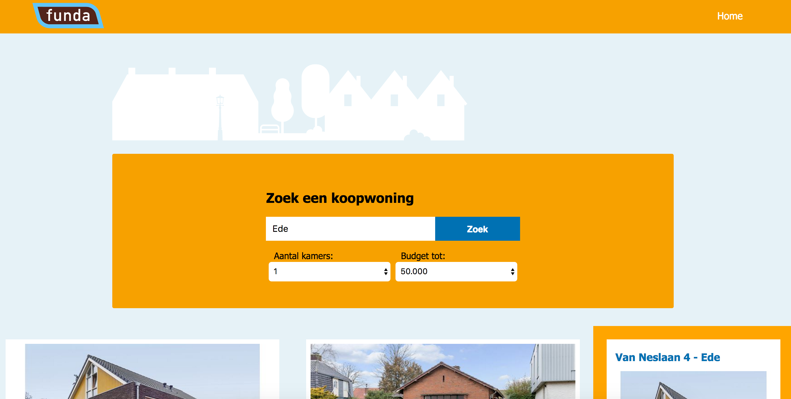
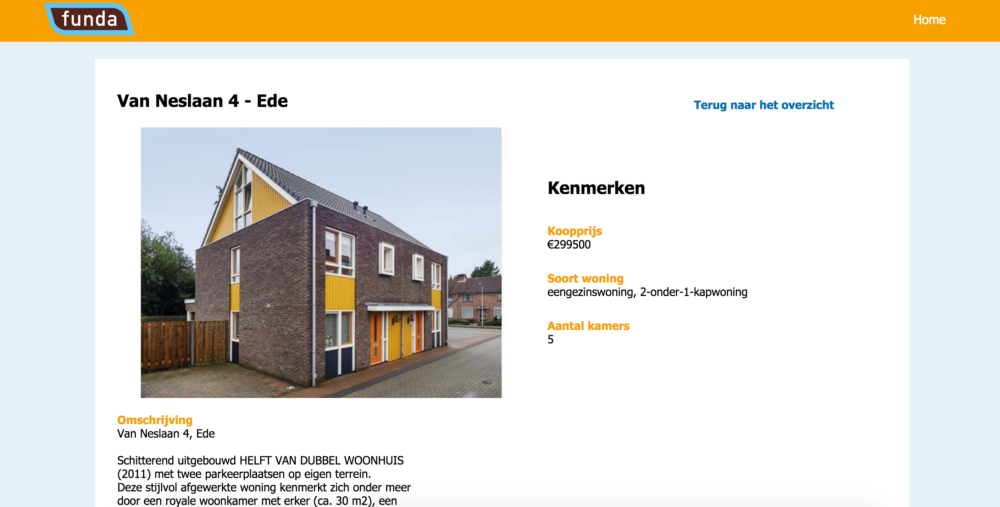
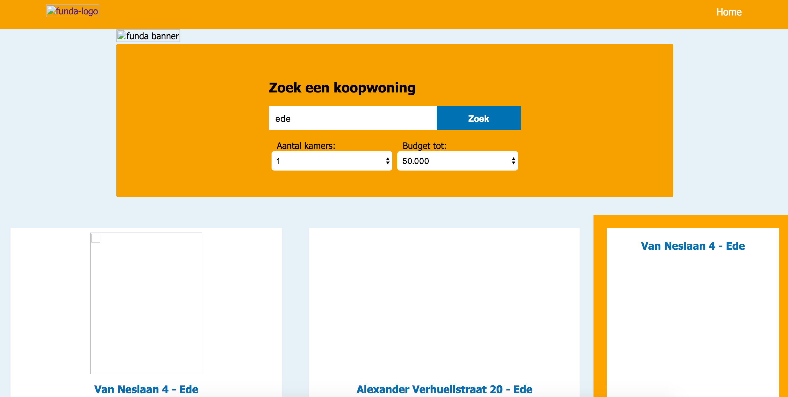
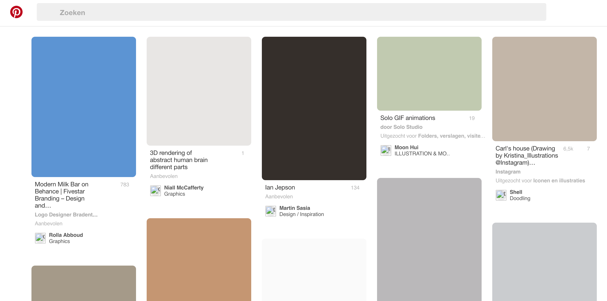
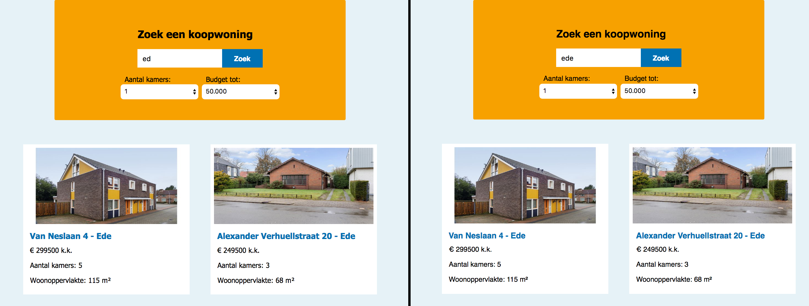

## Funda website analysis

As a developer you want everybody to be able to visit your work (website/app).

Everybody is a big target audience. This target audience has a lot of different people in it, like: developers, mothers, sons, grandparents, professionals, hobbyists and so on.

What we tend to forget is that in these groups there can be a group that isn't that able, like: people with broken arms, the blind, the colorblind, people with slow connections, people that have browsers that don’t support all the fancy stuff in your code and so on.

It’s important not to forget these people. This is why i’m going to check a web app I made for Funda (online estate agent). I had a week to make this web app and now i’m going to test if it’s also friendly for people that don’t have the same advantages as I do.

With the web app you could search for houses by entering the name of a place. You would see two sections. A section with the result and a section with house results that are 5km from the place you filled in, that also might be interesting. After you entered a place you could also filter on number of rooms and on budget. By clicking on these houses you will go to a screen with all the details from that house.

This is what I showed Funda:

In my analysis I will be looking at:
+ [Images](#images)
+ [Custom fonts](#customfonts)
+ javascript
+ colors
+ internet speed
+ cookies
+ screen reader
+ navigation without mouse.

---

### [Images](#images)
If you try to use my Funda web app without seeing the images, it will show the following:

As you can see (or not) there are two things happening. The logo and banner disappeared completely instead of seeing the space it needs to be in, you can only see the alt text. The images of the search result still reserve their spot. This is because I gave them a height of 16em. Because of the API I didn't give these images an alt text, so that’s why two situations were created.

__To do__
+ using svg for logos and banners
+ using a fixed with or height on every image
+ using alt text
using a color to fill the white space a lacking image leaves behind

### [Custom fonts](#customfonts)

I used 1 custom font: Tahoma. If the font doesn’t load, it falls back on to sans-serif. This way it stays in the same style as the font Tahoma.

Here is a screenshot from a split screen with on the left the Tahoma font and on the right the sans-serif fallback:

This works fine. What I could do to improve the performance is using font types woff and woff2. These are reduced sizes of the font and it has the widest support but isn’t available for a few older browsers.

__To do__
+ use woff and woff2

