## Funda website analysis

As a developer you want everybody to be able to visit your work (website/app).

Everybody is a big target audience. This target audience has a lot of different people in it, like: developers, mothers, sons, grandparents, professionals, hobbyists and so on.

What we tend to forget is that in these groups there can be a group that isn't that able, like: people with broken arms, the blind, the colorblind, people with slow connections, people that have browsers that don’t support all the fancy stuff in your code and so on.

It’s important not to forget these people. This is why i’m going to check a web app I made for Funda (online estate agent). I had a week to make this web app and now i’m going to test if it’s also friendly for people that don’t have the same advantages as I do.

With the web app you could search for houses by entering the name of a place. You would see two sections. A section with the result and a section with house results that are 5km from the place you filled in, that also might be interesting. After you entered a place you could also filter on number of rooms and on budget. By clicking on these houses you will go to a screen with all the details from that house.

This is what I showed Funda:

In my analysis I will be looking at:
+ [Images](#images)
+ [Custom fonts](#custom-fonts)
+ [javascript](#js)
+ [Cookies](#cookies)
+ [Colors](#colors)
+ [Internet speed](#internet-speed)
+ [Screen reader](#screen-reader)
+ [navigation without mouse](#navigation-without-mouse)

---

### [Images](#images)
If you try to use my Funda web app without seeing the images, it will show the following:

As you can see (or not) there are two things happening. The logo and banner disappeared completely instead of seeing the space it needs to be in, you can only see the alt text. The images of the search result still reserve their spot. This is because I gave them a height of 16em. Because of the API I didn't give these images an alt text, so that’s why two situations were created.

__To do__
+ using svg for logos and banners
+ using a fixed with or height on every image
+ using alt text
using a color to fill the white space a lacking image leaves behind

---

### [Custom fonts](#custom-fonts)

I used 1 custom font: Tahoma. If the font doesn’t load, it falls back on to sans-serif. This way it stays in the same style as the font Tahoma.

Here is a screenshot from a split screen with on the left the Tahoma font and on the right the sans-serif fallback:

This works fine. What I could do to improve the performance is using font types woff and woff2. These are reduced sizes of the font and it has the widest support but isn’t available for a few older browsers.

__To do__
+ use woff and woff2

---

### [javascript](#js)

The whole web app was build on javascript. Bij turning that off I was only able to see the search field. And that didn't function.

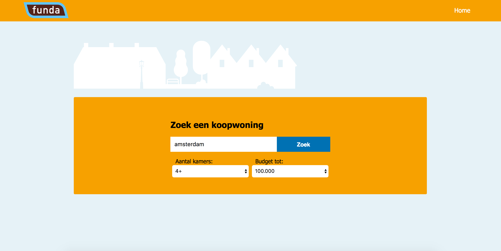

__To do__
+ use javascript as an extra not to function the whole site
+ alert the user that it doesn't work without javascript

---

### [Cookies](#cookies)

There were no cookies used.

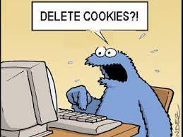

---

### [Colors](#colors)

The colors I used where the colors that Funda used on their own website. With a tool called Sim Daltonism I checked what the colorblind would see. I used 3 filters: Monochromacy (black and white), deuteranopia (red-green confusion) and tritanopia (yellow-blue confusion). I'm displaying them in the exact order:

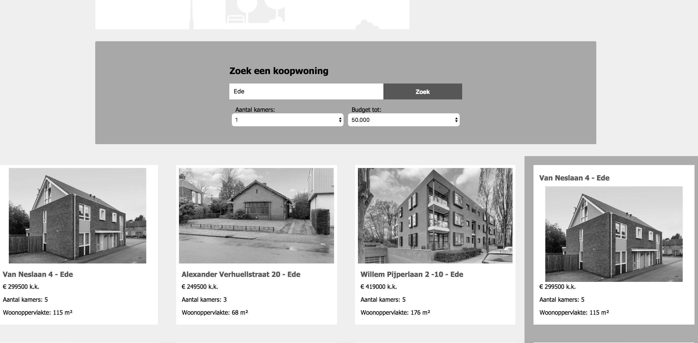
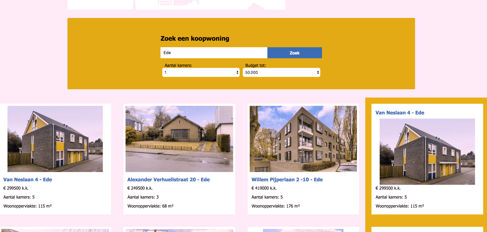
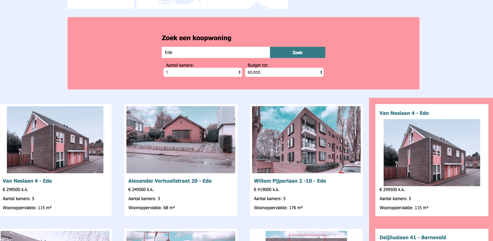

The contrast seems good on all of the filter, so I dont see why this should be adjusted.

---

### [Internet speed](#internet-speed)

Testing this was really interesting. I put the throtteling on: Regular 2G (300 ms, 250 kb/s, 50 kb/s). It took 9.02 second to load, because of the Tahoma font:

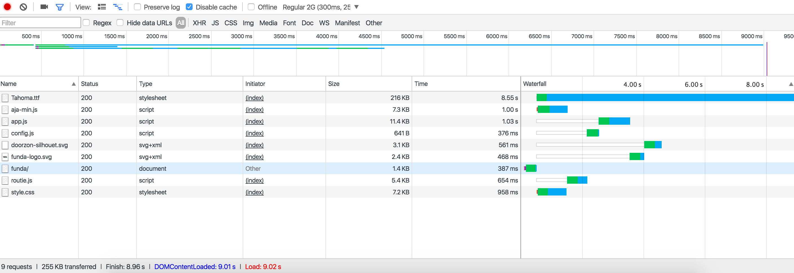

It took only 47ms (!) to load without the font:

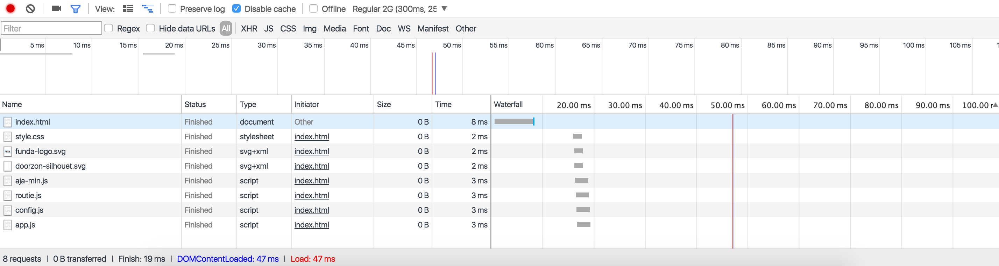

The search query was also interesting to test.
With the Tahoma font it took 8.94 s and the 25 houses took 13.1 min (!) to load.

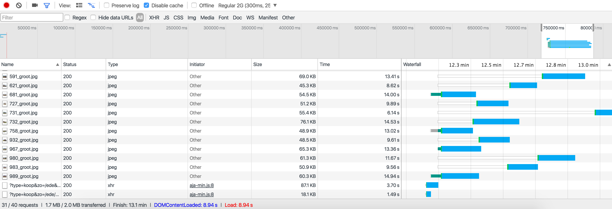

The search query was also fast. Without the font it took 54 ms. However, it took 1.1 min to load all the 25 houses. To prevent this we could use smaller img sizes from the funda API.

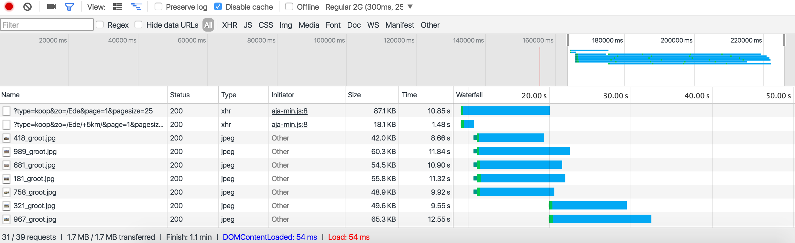

I also tested this on a Samsung s4-mini, which runs on 3G. It didn't have problems loading the houses.

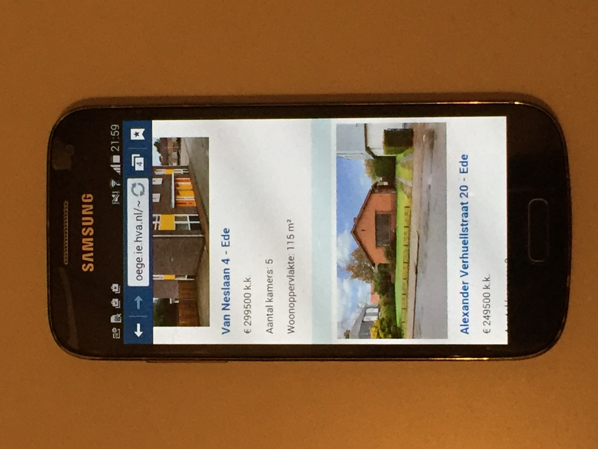

__To do__
+ use woff and woff2
+ use different API information

---

### [Screen reader](#screen-reader)

I did a test with the voice over from Apple. I normally don't use this tool and so I struggeled with the commands. However I managed to let it read the houses to me. This was dissapointing. It used the exact html I put in my javascript. That also means I got the URL from the image. I'm not sure how to solve that. Maybe I could try using a template. Eventhough it was dissapointing to me, it did work.

__To do__
+ try using a template

### [navigation without mouse](#navigation-without-mouse)

Tabbing through my website was easy. I didn't need to use my mouse. Everything is clickable. I can tab through the navigation, through de filters and through the houses. Even the order of the houses is correct (2 sections of houses, first section is the direct result). If you are on a house and you hit the enter button, you end up at the detailpage. So it really works well. What I could change is darkening the border of the :focus for the people that don't see the difference that well.

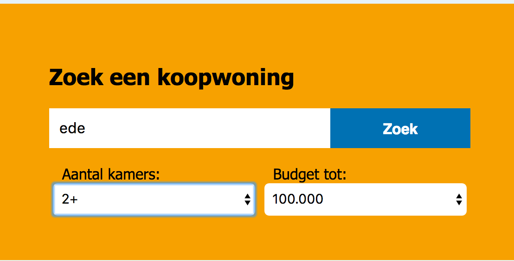
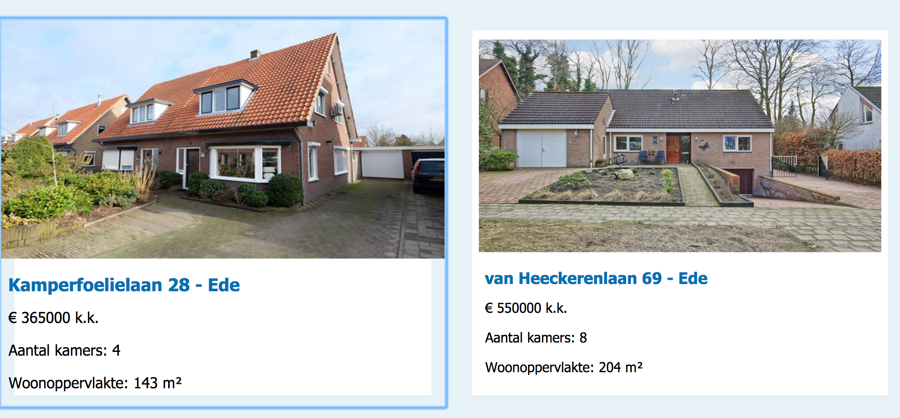

__To do__
+ change the :focus color to a darker color
