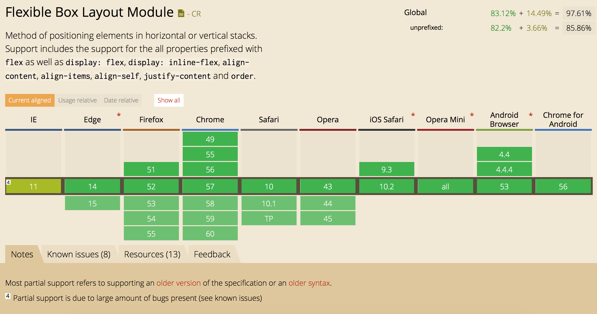
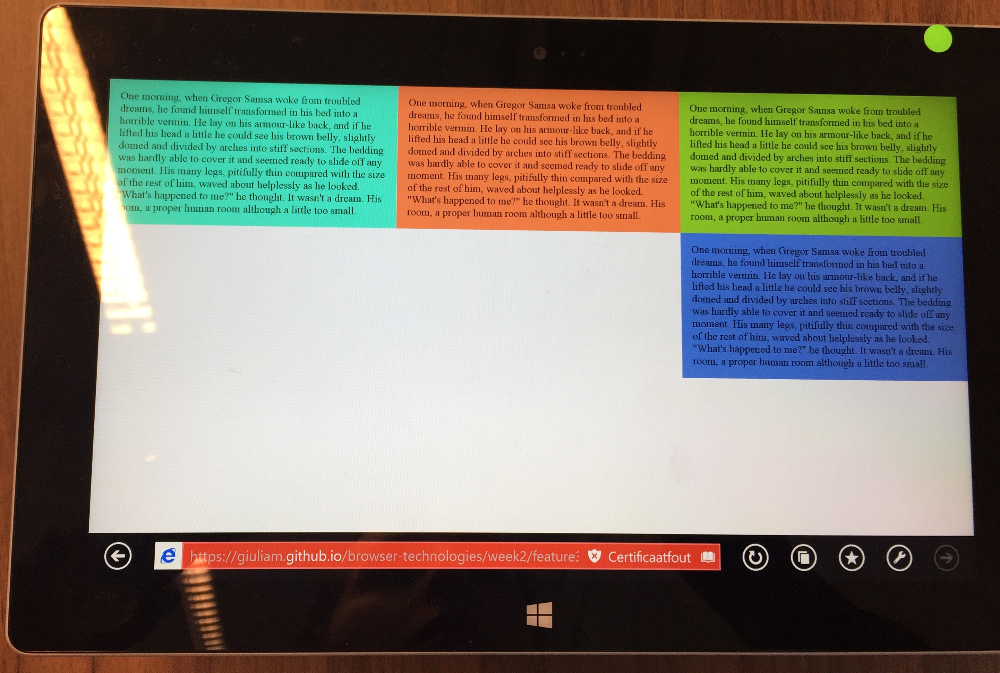
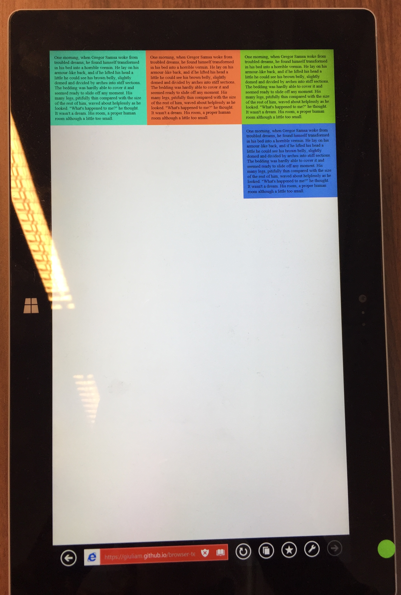
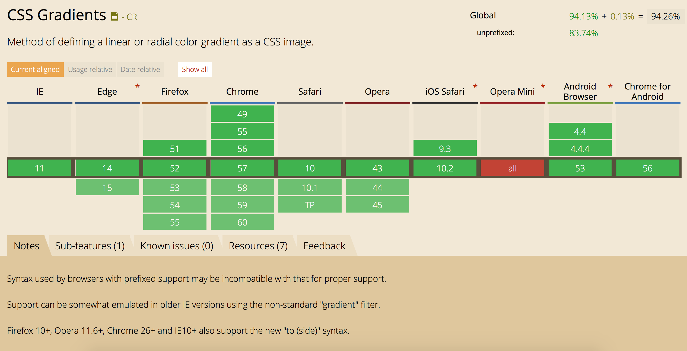

# features

6 features explained and explored
- [WebP](#webp) (HTML)
- [`<input type=color>`](#input) (HTML)
- [Display flex](#display-flex) (CSS)
- [Gradient](#gradient) (CSS)

---

## [WebP](#webp)
WebP is an image format that ensures superior compression (lossless and lossy) of photos by using predictive coding to encode an image. With WebP web developers can enhanche the speed of their websites.

[Demo](https://giuliam.github.io/browser-technologies/week2/feature1html/index.html)

__Advantages are:__
- 26% smaller compared to PNG
- 25-24% smaller compared to JPEG
- supports transparency (just 22% extra bytes)

__Disadvantages are:__
- not working in all browsers

__The following browsers don’t support webP:__
- Internet Explore
- Edge
- Firefox
- Safari/IOS Safari

__Solution/Fallback:__
- add an img tag in the picture element.

If the picture element and the webP don't get recognized, it will automatically skip them and only use the img element.

__Demo__
For the demo I alterized two pictures. I added a blue block with the text WebP on the WebP image and for the PNG I changed the text into PNG. WebP doesn't work in safari, so if you want to test it you should look at it in chrome (WebP) and in safari (PNG).

[Demo](https://giuliam.github.io/browser-technologies/week2/feature1html/index.html)

__Sources:__
- [WebP](https://developers.google.com/speed/webp/)
- [Keycdn](https://www.keycdn.com/blog/convert-to-webp-the-successor-of-jpeg/)
- [Envatotuts+](https://code.tutsplus.com/tutorials/better-responsive-images-with-the-picture-element--net-36583)

---

## [`<input type=color>`](#input)
`<input type=color>` is an input field in which the user can pick a color.
[Demo](https://giuliam.github.io/browser-technologies/week2/feature2html/index.html)

__Advantages are:__
- Easy and fun way for users to pick a color

__Disadvantages are:__
- not working in all browsers

__The following browsers don’t support webP:__
- Internet Explore
- Opera mini
- Safari/IOS Safari

__Solution/Fallback:__
- use a placeholder

When a browser isn't able to use `<input type=color>` it will fallback on `text=input`. By giving it a `placeholder=''` you can still tell the user what to enter in the text input. [Demo](https://giuliam.github.io/browser-technologies/week2/feature2html/index.html)

__Sources:__
- [Wufoo](https://www.wufoo.com/html5/types/6-color.html)
- [MDN](https://developer.mozilla.org/en-US/docs/Web/HTML/Element/input/color)

---

## [Display flex](#display-flex)
The main idea behind display is to give the container the ability to alter its items' width/height (and order) to best fill the available space. This is usefull to make websites responsive: available for all sizes.
[Demo](https://giuliam.github.io/browser-technologies/week2/feature2html/index.html)

__Advantages are:__
- Responsively low maintainance
- Adaptive to a lot of screens

__Disadvantages are:__
- Not supported by all browsers

__The following browsers don’t support `display:flex`:__
- Internet Explore 11
- Older browsers

__Solution/Fallback:__
- Creat a fallback with float

Some browsers can't handle `display:flex`. For example Internet Explore. In that case you need a fallback that can support browsers that don't support `display:flex`. You can do this with `display:block` and `float:left`/`float:right`.
Depending on what kind of style you want, you can change heights

[Demo](https://giuliam.github.io/browser-technologies/week2/feature3css/index.html)

Tested it on a windows tablet with Internet Explore:

__Sources:__
- [MDN](https://developer.mozilla.org/en-US/docs/Web/CSS/display)

---

## [Gradient](#gradient)
The CSS `linear-gradient()` makes it able to display a smooth a transition between colors. You can also decide the angle in which they should meet. For the demo I used this code: `linear-gradient(135deg, pink, cornflowerblue);` de 135deg is the angle you set, and in my case I used the colors pink and cornflowerblue.
[Demo](https://giuliam.github.io/browser-technologies/week2/feature4css/index.html)

__Advantages are:__
- You can create a more dynamic background

__Disadvantages are:__
- Not supported by all browsers

__The following browsers don’t support `linear-gradient()`:__
- Opera Mini

__Solution/Fallback:__
- set a `background-color`

[Demo](https://giuliam.github.io/browser-technologies/week2/feature4css/index.html)

__Sources:__
- [MDN](https://developer.mozilla.org/en-US/docs/Web/CSS/linear-gradient)

