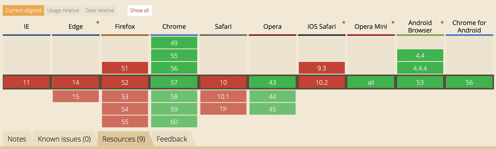

# features

6 features explained and explored
- [WebP](#webp)
- [`<input type=color>`](#<input-type=color>)
---

## [WebP](#webp)
WebP is an image format that ensures superior compression (lossless and lossy) of photos by using predictive coding to encode an image. With WebP web developers can enhanche the speed of their websites.

__Advantages are:__
- 26% smaller compared to PNG
- 25-24% smaller compared to JPEG
- supports transparency (just 22% extra bytes)

__Disadvantages are:__
- not working in all browsers

__The following browsers don’t support webP:__
- Internet Explore
- Edge
- Firefox
- Safari/IOS Safari

__Solution/Fallback:__
- add an img tag in the picture element.

If the picture element and the webP don't get recognized, it will automatically skip them and only use the img element.

__Demo__
For the demo I alterized two pictures. I added a blue block with the text WebP on the WebP image and for the PNG I changed the text into PNG. WebP doesn't work in safari, so if you want to test it you should look at it in chrome (WebP) and in safari (PNG).

[Demo](https://giuliam.github.io/browser-technologies/week2/feature1html/index.html)

__Sources:__
- [WebP](https://developers.google.com/speed/webp/)
- [Keycdn](https://www.keycdn.com/blog/convert-to-webp-the-successor-of-jpeg/)
- [Envatotuts+](https://code.tutsplus.com/tutorials/better-responsive-images-with-the-picture-element--net-36583)

---

## [`<input type=color>`](#<input-type=color>)
`<input type=color>` is an input field in which the user can pick a color.

__Advantages are:__
- Easy and fun way for users to pick a color

__Disadvantages are:__
- not working in all browsers

__The following browsers don’t support webP:__
- Internet Explore
- Opera mini
- Safari/IOS Safari

__Solution/Fallback:__
- use a placeholder

When a browser isn't able to use `<input type=color>` it will fallback on `text=input`. By giving it a `placeholder=''` you can still tell the user what to enter in the text input.

[Demo](https://giuliam.github.io/browser-technologies/week2/feature2html/index.html)

__Sources:__
- [Wufoo](https://www.wufoo.com/html5/types/6-color.html)
- [MDN](https://developer.mozilla.org/en-US/docs/Web/HTML/Element/input/color)
