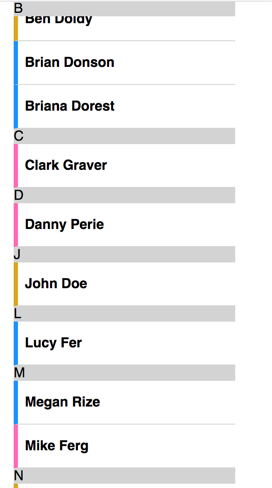
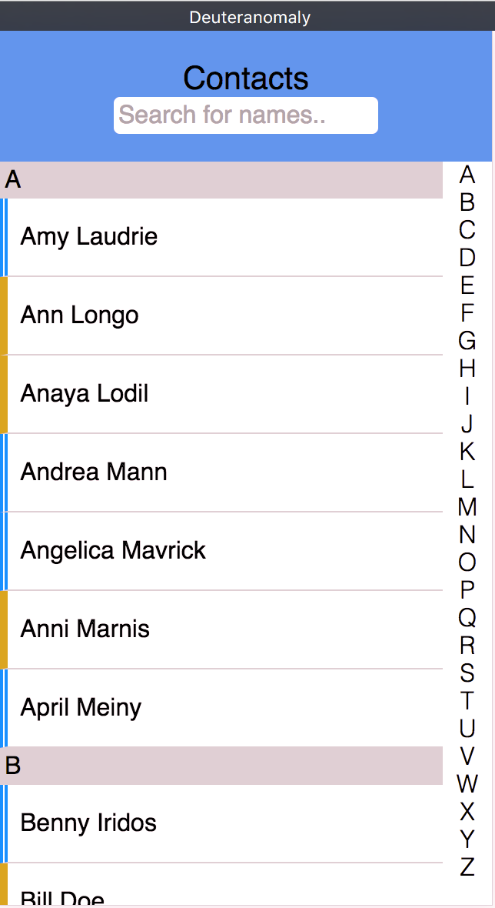
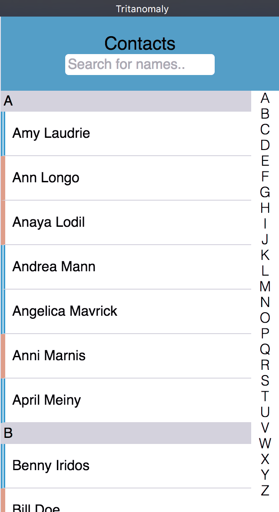

## Contact list

[Demo](https://giuliam.github.io/browser-technologies/week3/contactlist/index.html)

This demo is a contact list, in which you can search by letter. It's build with the idea of progressive enhancement. Starting with HTML and enhancing it with CSS and Javascript.

## Index
- [HTML](#html)
- [CSS](#css)
- [JS](#js)
- [Wishlist](#wishlist)

---

## [HTML](#html)
For HTML I used the `
` element. This element is used as widget which the user can use to retrieve information.

By using `summary` you can tell the user what information you can find by opening the widget.

Unfortunately not every browser supports the `
` attribute.

This list seems to be a little outdated, because it also works on opera mini. But it doesn't work on Internet Explorer. If `
` doesn't work it will show the widget opened. Showing all the information. With CSS you can make hierarchy in the structure.

### Extra HTML
- `a href=tel:`: by clicking on the number it initiates a phonecall
- `a href=mailto:`: by clicking on email it initiates a mail

### Source
- [MDN](https://developer.mozilla.org/en-US/docs/Web/HTML/Element/details)
- [Can I use?](http://caniuse.com/#search=detail)
- [HTML5 doctor](http://html5doctor.com/the-details-and-summary-elements/)

---

## [CSS](#css)
`position: sticky` is a CSS attributes in which you can fix an element to the viewport. In my case I used it for the letters that indicate where you are in the contact list. For example: When scrolling down the list from names with an A to names with a B, the heading A will stay in the viewport until names with the B are reached.

Unfortunately not every browser supports `position: sticky`. Especially mobile browsers don't work with `position: sticky`. Also IE doesn't work

### Extra CSS
- `overflow`: to scroll the list

Besides trying to make it look pretty, I was also keeping in mind that the colorblind will also need to be able to use this. So I tried to give more clarification by adding left-borders in different styles. This is for showing in wich group those contacts are sorted. Trying to understand the colorblind I needed to see like the colorblind. I used Sim-Daltonism to do this:

And ofcourse the color ratio is also important and for that I used Lea Verou's tool:

### Source
- [MDN](https://developer.mozilla.org/en/docs/Web/CSS/position#Sticky_positioning)
- [Can I use?](http://caniuse.com/#search=stick)
- [CSS Tricks](https://css-tricks.com/almanac/properties/a/animation/)
- [Contrast Ratio](http://leaverou.github.io/contrast-ratio/#%23bababa-on-%23f9f7f9)
- [Rijk van Zanten](http://codepen.io/RijkvanZanten/pen/KWrEdy)

---

## [JS](#js)

The Javascript I used was for the search filter. By entering a view letters, it filters out the rest of the contacts.

The filter doesn't work without javascipt. So when javascript is disabled the search field will dissapear.

### Source
- [W3Schools](https://www.w3schools.com/howto/tryit.asp?filename=tryhow_js_filter_list)
- [Pali Madra](http://codepen.io/palimadra/pen/uoJnl?editors=1010)
- [MDN](https://developer.mozilla.org/en-US/docs/Web/Events/DOMContentLoaded)

---

I would of liked to have more time for this project, because there are still a lot of cool things you can do with this demo. So here is my wishlist:

## [Wishlist](#wishlist)
- Adding icons to number, address and email
- Google Maps by clicking the adress
- Make the alphabet interactive with touch (like the iPhone contacts app has)
- Better solution for groups in combination with the colorblind
- Smooth scrooling

